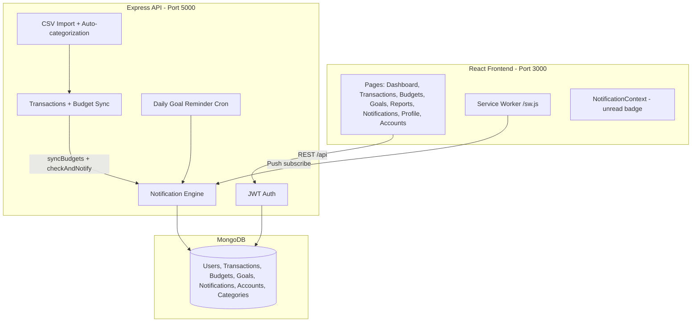

# MoneyMap — Personal Finance Analytics Dashboard

## Comprehensive Project Report

**Course:** Advanced Web Technologies (AWT)  
**Assessment:** Midterm Lab — Full-Stack Application  
**Submitted By:**
- Hamza Farooq (FA23-BSE-038)
- Hamza (FA23-BSE-037)

**Date:** May 2026  
**Project Name:** MoneyMap (branded UI) / finance-dashboard-api (package)

---

## Table of Contents

1. [Executive Summary](#1-executive-summary)
2. [System Overview](#2-system-overview)
3. [Technology Stack](#3-technology-stack)
4. [Project Structure](#4-project-structure)
5. [Database Design](#5-database-design)
6. [Backend API Reference](#6-backend-api-reference)
7. [Notification System (Complete)](#7-notification-system-complete)
8. [Frontend Application](#8-frontend-application)
9. [Expense Tracker Module](#9-expense-tracker-module)
10. [Authentication & Security](#10-authentication--security)
11. [Bugs Fixed in This Release](#11-bugs-fixed-in-this-release)
12. [Setup & Installation](#12-setup--installation)
13. [Testing](#13-testing)
14. [Manual Verification Guide](#14-manual-verification-guide)
15. [Known Limitations & Future Work](#15-known-limitations--future-work)
16. [Conclusion](#16-conclusion)

---

## 1. Executive Summary

**MoneyMap** is a full-stack personal finance application that helps users track income and expenses, manage monthly budgets, set savings goals, import bank CSV statements, and receive intelligent alerts when spending thresholds are crossed.

The system consists of:

| Layer | Technology |
|-------|------------|
| **Backend API** | Node.js, Express 5, MongoDB (Mongoose 9), JWT |
| **Frontend SPA** | React 19, Vite 8, React Router 7, Chart.js |
| **Notifications** | In-app (MongoDB), Web Push (VAPID), Email (Nodemailer) |
| **Automation** | node-cron for savings goal reminders |

**Scale:** 8 Mongoose models, 11 controllers, 10 route modules, 50+ authenticated API endpoints, 9 frontend pages, automated Jest test suites.

---

## 2. System Overview



### Core User Journeys

1. **Register / Login** → JWT stored in `localStorage`
2. **Add expense** → Budget recalculated → Alert if 80% or 100% threshold crossed
3. **Import CSV** → Parse bank statement → Review categories → Confirm → Budget sync + alerts
4. **View Notifications** → In-app list with unread badge; optional browser push from Profile
5. **Set savings goal** with reminder frequency → Cron sends periodic in-app reminders

---

## 3. Technology Stack

### Backend Dependencies

| Package | Purpose |
|---------|---------|
| express ^5.2 | REST API framework |
| mongoose ^9.5 | MongoDB ODM |
| bcryptjs | Password hashing |
| jsonwebtoken | JWT authentication |
| joi | Request validation |
| helmet, cors | Security |
| multer, csv-parse | CSV file upload/parsing |
| node-cron | Scheduled goal reminders |
| nodemailer | High-severity email alerts |
| web-push | Browser push notifications |

### Frontend Dependencies

| Package | Purpose |
|---------|---------|
| react ^19 | UI framework |
| react-router-dom ^7 | Client-side routing |
| vite ^8 | Build tool and dev server |
| chart.js + react-chartjs-2 | Dashboard charts |
| lucide-react | Icons |
| react-hot-toast | Toast notifications |

---

## 4. Project Structure

```
lab-mid-awt/
├── src/                          # Backend
│   ├── app.js                    # Entry, routes, cron startup
│   ├── config/                   # database.js, env.js
│   ├── models/                   # 8 Mongoose schemas
│   ├── controllers/              # 11 controllers
│   ├── routes/                   # 10 route modules
│   ├── middleware/               # auth, errors, rate limit, logger
│   ├── validators/               # Joi schemas
│   ├── services/                 # budget sync, notifications, CSV, categorization
│   ├── seeds/                    # Pakistan category seeder
│   └── __tests__/                # unit, integration, regression, uat
├── frontend/
│   ├── public/sw.js              # Web Push service worker
│   └── src/
│       ├── pages/                # 9 page components
│       ├── components/           # Layout, Modal, CSVImportTab
│       ├── context/              # AuthContext, NotificationContext
│       └── hooks/                # usePushNotifications
├── Phase3/                       # Implementation notes
├── PROJECT-REPORT.md             # This document
├── README.md
└── postman-collection.json
```

---

## 5. Database Design

### Models (8 total)

| Model | Purpose |
|-------|---------|
| **User** | Auth, currency preference, `pushSubscription` for Web Push |
| **Transaction** | Income/expense records with legacy category enum |
| **Budget** | Monthly per-category limits with `spentAmount` |
| **SavingsGoal** | Targets, contributions, `reminderFrequency`, `lastRemindedAt` |
| **Notification** | In-app alerts (`budget_alert`, `goal_reminder`, `transaction_confirmation`) |
| **Account** | Bank/wallet/card/cash accounts for CSV import |
| **Category** | Pakistan-specific expense categories (system + user custom) |
| **MonthlySummary** | Aggregated expense summaries per account/month |

### Notification Schema

| Field | Type | Notes |
|-------|------|-------|
| userId | ObjectId | Required, indexed |
| type | String | `budget_alert`, `goal_reminder`, `transaction_confirmation` |
| message | String | Max 500 chars |
| isRead | Boolean | Default false |

### User Extensions (Phase 3)

| Field | Type | Notes |
|-------|------|-------|
| pushSubscription | Mixed | Web Push subscription JSON from browser |

### SavingsGoal Extensions (Phase 3)

| Field | Type | Notes |
|-------|------|-------|
| reminderFrequency | String | `daily`, `weekly`, `monthly`, `none` (default) |
| lastRemindedAt | Date | Tracks last cron reminder |

---

## 6. Backend API Reference

### Utility (no auth)

| Method | Path | Description |
|--------|------|-------------|
| GET | `/health` | Server health |
| GET | `/api/info` | API metadata |

### Auth — `/api/auth`

| Method | Path | Description |
|--------|------|-------------|
| POST | `/register` | Create account + JWT |
| POST | `/login` | Login + JWT |

### Users — `/api/users`

| Method | Path | Description |
|--------|------|-------------|
| GET | `/profile` | Profile (+ `hasPushSubscription`) |
| PUT | `/profile` | Update name, currency, password |
| DELETE | `/account` | Delete account (password in body) |

### Transactions — `/api/transactions`

| Method | Path | Description |
|--------|------|-------------|
| POST | `/` | Create (triggers budget sync + notifications) |
| GET | `/` | List with filters/pagination |
| GET | `/:id` | Single transaction |
| PUT | `/:id` | Update (triggers budget sync + notifications) |
| DELETE | `/:id` | Delete (triggers budget sync) |

### Budgets — `/api/budgets`

| Method | Path | Description |
|--------|------|-------------|
| POST | `/` | Create monthly budget |
| GET | `/` | List (`?month=YYYY-MM`) |
| GET | `/:id` | Single budget |
| PUT | `/:id` | Update limit |
| DELETE | `/:id` | Delete |

### Goals — `/api/goals`

| Method | Path | Description |
|--------|------|-------------|
| POST | `/` | Create (supports `reminderFrequency`) |
| GET | `/` | List (`?status=active`) |
| GET | `/:id` | Single goal |
| PUT | `/:id` | Update (supports `reminderFrequency`) |
| DELETE | `/:id` | Delete |
| PUT | `/:id/contribute` | Add contribution |

### Reports — `/api/reports`

| Method | Path | Description |
|--------|------|-------------|
| GET | `/monthly-summary` | Income/expense/savings |
| GET | `/category-breakdown` | Expense by category |
| GET | `/budget-vs-actual` | Budget vs spent |
| GET | `/income-expense-trend` | Multi-month trend |
| GET | `/yoy-comparison` | Year-over-year |
| GET | `/alerts` | Budget threshold alerts |

### Notifications — `/api/notifications`

| Method | Path | Description |
|--------|------|-------------|
| GET | `/` | Paginated list (`?type`, `?page`, `?limit`) |
| GET | `/unread` | Unread count + breakdown by type |
| GET | `/push/vapid-key` | VAPID public key for browser subscription |
| PUT | `/push/subscribe` | Save push subscription on user |
| DELETE | `/push/subscribe` | Remove push subscription |
| PUT | `/read-all` | Mark all read |
| PUT | `/:id/read` | Mark one read |
| DELETE | `/:id` | Delete one |

### Accounts — `/api/accounts`

Full CRUD for bank/wallet/card/cash accounts.

### Categories — `/api/categories`

List, create, update, delete custom categories.

### Expense Tracker — `/api/expense-tracker`

| Method | Path | Description |
|--------|------|-------------|
| POST | `/import` | Upload CSV (multipart) |
| POST | `/import/confirm` | Persist reviewed transactions |
| GET | `/import/history` | Import history |
| GET | `/supported-banks` | Supported bank list |
| GET | `/summary` | Monthly expense summary |
| GET | `/summary/:accountId` | Per-account summary |
| GET | `/review-queue` | Low-confidence categorizations |
| PUT | `/review/:transactionId` | Correct category (`categoryId`) |

---

## 7. Notification System (Complete)

### Architecture

The notification system uses a **dispatch pipeline** with three delivery channels:

| Channel | When | Severity |
|---------|------|----------|
| **In-app** | Always | All |
| **Web Push** | User subscribed | `warning`, `high` |
| **Email** | User has email | `high` only |

### Services

| File | Role |
|------|------|
| `pushNotification.service.js` | Creates DB record, sends web-push and email |
| `notificationTrigger.service.js` | Budget 80%/100% threshold crossing logic |
| `notificationCron.service.js` | Daily 10:00 AM goal reminders |
| `budgetSync.service.js` | Recalculates `spentAmount` from transactions |

### Trigger: Budget Alerts

Fired after transaction **create**, **update**, or **CSV import confirm** when `syncBudgets(userId, [month])` detects a change:

| Condition | Alert | Severity |
|-----------|-------|----------|
| Crosses ≥80% (was &lt;80%) | Warning message | `warning` |
| Crosses ≥100% (was &lt;100%) | Exceeded message | `high` |

**Dedup:** Same alert type/category not sent twice in the same calendar month.

**Requirements for alert to fire:**
- Expense transaction (income ignored)
- Budget exists for matching **category** and **month** (`YYYY-MM` from `transactionDate`)
- Spending must **cross** the threshold in that single sync (already-over-budget spends won't re-alert)

### Trigger: Large Transaction

Manual expense ≥ **Rs. 50,000** → `transaction_confirmation` notification, severity `high`.

### Trigger: Goal Reminders (Cron)

Runs daily at **10:00 AM** server time (skipped when `NODE_ENV=test`):

- Finds active goals where `reminderFrequency` is `daily`, `weekly`, or `monthly`
- Compares `lastRemindedAt` against interval
- Sends `goal_reminder` with severity `info` (in-app only)

### Frontend Integration

| Component | Role |
|-----------|------|
| `NotificationContext` | Global unread count, `refreshUnread()` |
| `Layout.jsx` | Sidebar badge on Notifications link |
| `Notifications.jsx` | List, mark read, delete |
| `Profile.jsx` | Enable/disable browser push |
| `usePushNotifications.js` | SW registration, VAPID subscribe, API calls |
| `public/sw.js` | Handles `push` and `notificationclick` events |
| `Transactions.jsx` | Calls `refreshUnread()` after create/update |
| `CSVImportTab.jsx` | Calls `refreshUnread()` after import confirm |

### Environment Variables (Optional)

```env
VAPID_PUBLIC_KEY=...
VAPID_PRIVATE_KEY=...
SMTP_HOST=smtp.example.com
SMTP_PORT=587
SMTP_USER=...
SMTP_PASS=...
```

Defaults exist for development (Ethereal email, generated VAPID keys). **Use real credentials in production.**

---

## 8. Frontend Application

### Routes

| Path | Page | Description |
|------|------|-------------|
| `/login` | Login | Public |
| `/register` | Register | Public |
| `/dashboard` | Dashboard | Financial overview, charts, review queue |
| `/transactions` | Transactions | Manual entry + CSV import tabs |
| `/budgets` | Budgets | Monthly category budgets |
| `/goals` | Goals | Savings goals + reminder frequency |
| `/reports` | Reports | Analytics charts |
| `/accounts` | Accounts | Bank/wallet management |
| `/notifications` | Notifications | Alert inbox |
| `/profile` | Profile | Settings, push toggle, delete account |
| `/import` | → `/transactions` | Legacy redirect |
| `/expense-tracker` | → `/dashboard` | Legacy redirect |

### Key UX Features

- Collapsible sidebar with unread notification badge
- Real-time badge refresh after transactions and imports
- Browser push opt-in from Profile page
- Dashboard review queue for miscategorized CSV transactions
- Smart account filtering by payment method on Transactions form

---

## 9. Expense Tracker Module

### CSV Import Flow

1. **Upload** — Select account, upload bank CSV (HBL, JazzCash, etc.)
2. **Parse** — Bank-specific parser extracts transactions
3. **Categorize** — Rule engine maps to Pakistan categories with confidence score
4. **Review** — Low-confidence items appear in Dashboard review queue
5. **Confirm** — Persist transactions, sync budgets, fire notifications

### Dual Category Systems

| System | Used By | Examples |
|--------|---------|----------|
| Legacy enum | Manual transactions, budgets | Food, Transport, Rent |
| Category collection | CSV import, review queue | Food & Dining, Kiryana Store |

The categorization service maps granular categories to legacy budget categories for consistent budget tracking.

---

## 10. Authentication & Security

- **JWT** — 7-day expiry, Bearer token in `Authorization` header
- **bcrypt** — 10 salt rounds, `passwordHash` excluded from queries
- **Helmet** — Security headers
- **CORS** — Configurable origin (`CORS_ORIGIN`)
- **Rate limiting** — 100 req/15min per IP (10,000 in development)
- **Ownership** — All queries scoped to `req.user.id`
- **Validation** — Joi on all inputs, 422 with field details

---

## 11. Bugs Fixed in This Release

| # | Issue | Fix |
|---|-------|-----|
| 1 | **Budget alerts never fired on manual transactions** | `syncBudgets(userId)` was called without required `months` array → always returned `[]`. Now passes `[YYYY-MM]` from transaction date. |
| 2 | **No push subscription API** | Added `GET /push/vapid-key`, `PUT/DELETE /push/subscribe`. |
| 3 | **No service worker / push UI** | Added `sw.js`, `usePushNotifications` hook, Profile toggle. |
| 4 | **Unread badge stale** | `NotificationContext` refreshes after transactions, imports, and navigation. |
| 5 | **Profile delete broken** | Frontend used `PUT`; backend expects `DELETE` → fixed with `api.deleteWithBody`. |
| 6 | **Dashboard review queue broken** | Sent `categoryName`; API requires `categoryId` → fixed dropdown values. |
| 7 | **Broken sidebar links** | `/import` and `/expense-tracker` had no routes → redirects + nav cleanup. |
| 8 | **Goal reminders non-functional** | `reminderFrequency` not in validator/UI → added to Goals form and API. |
| 9 | **Delete transaction skipped budget sync** | Added `syncBudgets` on delete. |
| 10 | **Invalid notification type for large expenses** | Changed `large_transaction` → `transaction_confirmation`. |
| 11 | **Cron ran during tests** | Cron skipped when `NODE_ENV=test`. |
| 12 | **Large expense type enum mismatch** | Uses valid `transaction_confirmation` type. |

---

## 12. Setup & Installation

### Prerequisites

- Node.js 18+
- MongoDB (local or Atlas)
- Modern browser (Chrome/Firefox/Edge for push)

### Backend

```bash
cd lab-mid-awt
npm install
cp .env.example .env   # or create .env
# Set: PORT, MONGODB_URI, JWT_SECRET, CORS_ORIGIN=http://localhost:3000
npm run dev            # http://localhost:5000
```

### Frontend

```bash
cd frontend
npm install
npm run dev            # http://localhost:3000 (proxies /api to backend)
```

### Environment Variables

| Variable | Description |
|----------|-------------|
| `PORT` | API port (default 5000) |
| `MONGODB_URI` | MongoDB connection string |
| `JWT_SECRET` | JWT signing key |
| `JWT_EXPIRY` | Token lifetime (default 7d) |
| `CORS_ORIGIN` | Frontend URL |
| `NODE_ENV` | `development`, `production`, or `test` |
| `VAPID_PUBLIC_KEY` | Web Push public key (optional) |
| `VAPID_PRIVATE_KEY` | Web Push private key (optional) |
| `SMTP_*` | Email delivery (optional) |

---

## 13. Testing

### Automated Tests

| Suite | Command | Coverage |
|-------|---------|----------|
| Unit | `npm run test:unit` | CSV parsers, categorization, **notificationTrigger** |
| Integration | `npm run test:integration` | Expense tracker API, **notifications API** |
| Regression | `npm run test:regression` | Core API backward compatibility |
| UAT | `npm run test:uat` | User journeys |
| All | `npm test` | Full suite |

### Notification Tests Added

**Unit** (`notificationTrigger.test.js`):
- Exceeded alert on 100% threshold cross
- Warning alert on 80% threshold cross
- No alert when already above threshold
- Empty input handling

**Integration** (`notifications.api.test.js`):
- VAPID key endpoint
- Push subscription save
- Budget exceeded → in-app notification created
- Unread count and mark-all-read

### Frontend Build

```bash
cd frontend && npm run build   # Verified — builds without errors
```

### Test Results (May 2026)

| Suite | Result |
|-------|--------|
| `notificationTrigger.test.js` | 4/4 passed |
| `notifications.api.test.js` | 5/5 passed |
| Frontend production build | Success |

---

## 14. Manual Verification Guide

### In-App Budget Alert

1. Start backend (`npm run dev`) and frontend (`cd frontend && npm run dev`)
2. Login or register
3. **Budgets** → Create Food budget for current month, limit **1000**
4. **Transactions** → Add expense Food **400** (no alert yet if under 80%)
5. Add another expense Food **700** (total 1100 → crosses 100%)
6. **Notifications** → See `🚨 Budget exceeded!` message
7. Sidebar bell badge shows unread count

### Browser Push

1. **Profile** → Click **Enable Push Notifications**
2. Allow permission when browser prompts
3. Repeat budget exceed test → OS/browser notification should appear
4. Click notification → opens Notifications page

### Goal Reminder

1. **Goals** → Create goal with **Weekly** reminder frequency
2. Wait for cron (10:00 AM server) or temporarily lower interval in code for testing
3. Check Notifications for `goal_reminder` type

### CSV Import Alerts

1. **Transactions** → Import CSV tab
2. Import expenses that push a category over budget
3. Completion screen shows `notificationsSent` count
4. Notifications page lists new alerts

---

## 15. Known Limitations & Future Work

| Area | Limitation | Suggested Improvement |
|------|------------|----------------------|
| Categories | Dual systems (legacy + Pakistan) | Unified category model across UI |
| Email | Requires valid SMTP in `.env` | Document Ethereal setup for demos |
| Push | Requires HTTPS in production | Deploy behind TLS for real push |
| Real-time | No WebSocket; badge refreshes on actions | SSE or polling for live updates |
| Reports | `yoy-comparison` not in frontend UI | Add to Reports page |
| Tests | No frontend unit/e2e tests | Add Vitest + Playwright |
| Secrets | Default VAPID/SMTP in code | Move to env-only in production |

---

## 16. Conclusion

MoneyMap is a production-quality midterm lab deliverable combining a **RESTful Express API**, a **React SPA**, and an **intelligent notification engine** with in-app, push, and email channels. Phase 3 added CSV bank import, auto-categorization, dashboard unification, and a complete notification pipeline.

This release **fixes critical notification bugs** (budget sync on manual transactions), **implements end-to-end browser push**, and **resolves multiple frontend/backend inconsistencies** (profile delete, review queue, navigation, goal reminders).

The project demonstrates proficiency in full-stack JavaScript development, MongoDB aggregation, JWT security, service workers, scheduled jobs, and systematic automated testing.

---

*Report generated: May 2026 — MoneyMap / finance-dashboard-api*
